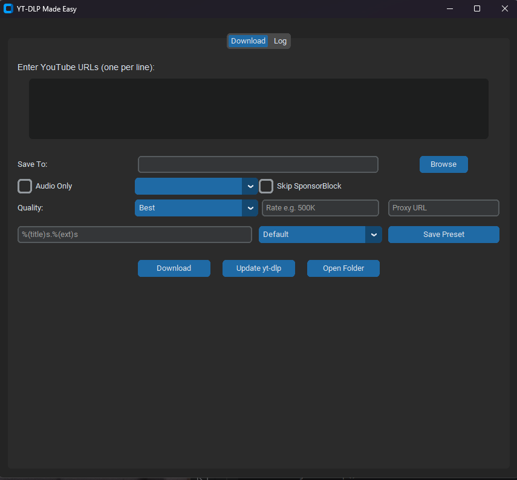

# YT-DLP Made Easy

A modern, one-file GUI wrapper around [yt-dlp](https://github.com/yt-dlp/yt-dlp)  
built with **Python, CustomTkinter and a pinch of o3**.



---


## Features

- Batch download: paste multiple URLs
- Quality selector: Best / 1080p / 720p / 480p
- Audio-only mode (MP3)
- Subtitle language picker
- SponsorBlock removal
- Rate-limit and proxy fields
- Custom output template (`%(title)s.%(ext)s`, etc.)
- Clipboard watcher: auto-pastes copied YouTube links
- Desktop notification on completion
- Real-time log tab
- In-app **Update yt-dlp** button

---

## Installation

### Pre-built executable (Windows)

1. Download the latest archive from **[Releases](https://github.com/hardtokidnap/Yt-dlp-made-easy/releases)** (`yt-dlp-made-easy-x.y.z.zip`).
2. Unzip anywhere.
3. Run `yt-dlp-made-easy.exe`.  
   If yt-dlp needs an update, click **Update yt-dlp** inside the app.

### Run from source

```bash
git clone https://github.com/hardtokidnap/yt-dlp-made-easy.git
cd yt-dlp-made-easy
python -m pip install -r requirements.txt   # Python 3.12 recommended
python main.py
